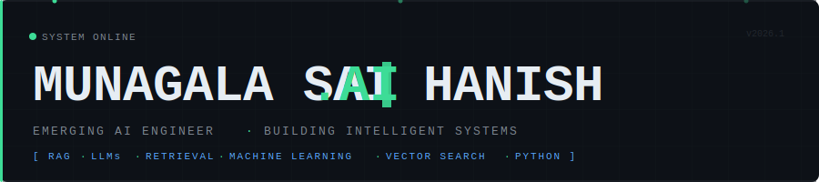
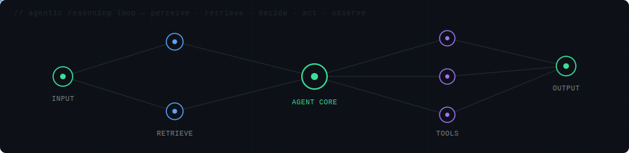

<!--
  ╔══════════════════════════════════════════════════════════════╗
  ║  HANISH.AI — GitHub Profile README                          ║
  ║  Design: Futuristic AI Engineering Identity                  ║
  ║  Author: MunagalaSaiHanish                                   ║
  ╚══════════════════════════════════════════════════════════════╝
-->

<div align="center">



<br/>

<!-- Dynamic typing animation — regenerated on every load, not hardcoded -->


</div>

<div align="center">

</div>

<br/>

<!-- ═══════════════════════════════════════════════════════════ -->
<!-- WHOAMI — Engineering identity                              -->
<!-- ═══════════════════════════════════════════════════════════ -->

## `$ whoami`

I'm **Hanish** — a Computer Science Engineering student building toward a career as an AI Engineer, not by collecting technologies, but by understanding the systems that make intelligence possible.

My focus is on **retrieval**, **language model pipelines**, **agentic systems**, and **intelligent system design**. I learn by engineering: every project is a deliberate attempt to understand one more concept from the inside — how embeddings encode meaning, why chunking strategy affects retrieval quality, how an agent decides its next action.

I'm not interested in calling AI APIs and calling it AI Engineering. I'm interested in understanding and building the components that make those APIs work.

**Currently studying:** Retrieval-Augmented Generation, vector representations, semantic search, agentic reasoning loops, and LLM integration patterns.

**Building toward:** Agentic AI systems, production-grade RAG, evaluation frameworks, guardrails, LLMOps, and — eventually — robotics + autonomous intelligent systems.

<div align="center">

</div>

<br/>

<!-- ═══════════════════════════════════════════════════════════ -->
<!-- AGENT NETWORK — AI / agentic visual identity               -->
<!-- ═══════════════════════════════════════════════════════════ -->

<div align="center">



<sub>The reasoning loop every agent I build runs on — perceive → retrieve context → decide next action → act → observe → repeat.</sub>

</div>

<div align="center">

</div>

<br/>

<!-- ═══════════════════════════════════════════════════════════ -->
<!-- CURRENT MISSION — control panel                            -->
<!-- ═══════════════════════════════════════════════════════════ -->

## `◈ CURRENT_MISSION`

```
┌──────────────────────────────────────────────────────────────┐
│  MISSION CONTROL                                    [ ACTIVE ]│
├──────────────────────────────────────────────────────────────┤
│  →  Master Agentic AI system design                          │
│  →  Build RecSen AI into a production-grade incident agent   │
│  →  Engineer production-quality RAG systems (Lumixa AI)      │
│  →  Learn advanced retrieval + LLM evaluation                │
│  →  Explore Robotics + embodied AI                            │
│  →  Become a production-ready AI Engineer                    │
└──────────────────────────────────────────────────────────────┘
```

<div align="center">

</div>

<br/>

<!-- ═══════════════════════════════════════════════════════════ -->
<!-- SYSTEM_NODES — Project registry                            -->
<!-- ═══════════════════════════════════════════════════════════ -->

## `◈ SYSTEM_NODES`

> *Each node is an engineered system. Each system teaches a concept.*
> *Featured projects — swap these panels out as new systems ship.*

<br/>

<!-- FLAGSHIP — Agentic AI -->
<table width="100%">
<tr><td width="100%" valign="top">

### ◈ RecSen AI &nbsp; `FLAGSHIP · AGENTIC AI`
**Autonomous Incident Investigation Agent**

An agent that investigates production incidents on its own: given an incident description and a service name, it runs a bounded reasoning loop — decide the next action, execute it against the service, observe the result, and repeat — until it reaches a conclusion or hits a step limit.

```
CONCEPTS      →  Agentic Loops · Tool-Calling Actions · Structured
                 Decision-Making · Bounded Reasoning (max-step guard)
ARCHITECTURE  →  Perceive → Decide → Act → Observe  (ReAct-style loop)
STACK         →  Python · OpenAI API · Pydantic (structured outputs/schemas)
STATUS        →  IN ACTIVE DEVELOPMENT
REPO          →  github.com/MunagalaSaiHanish/RecSen-AI
```

</td></tr>
</table>

<br/>

<table width="100%">
<tr>

<td width="50%" valign="top">

### ◈ Lumixa AI &nbsp; `RAG ENGINEERING`
**AI-Powered Knowledge Assistant**

Turns YouTube videos, PDFs, websites, and plain text into a searchable knowledge base using Retrieval-Augmented Generation, then answers questions from that base instead of the model's memory alone — reducing hallucination.

```
CONCEPTS   →  RAG · Chunking · Embeddings · Semantic Search
              Context Building · Conversation Memory
RETRIEVAL  →  FAISS · Sentence Transformers (all-MiniLM-L6-v2)
LLM        →  Qwen · Streamlit interface
STATUS     →  LIVE — lumixa-ai.streamlit.app
```

</td>

<td width="50%" valign="top">

### ◈ Gift Genie AI &nbsp; `FULL-STACK + AI API`
**AI Gift Recommendation Web App**

A full-stack app that takes a person's interests, budget, and occasion, sends them to a backend service, and returns AI-generated gift suggestions — built to understand how frontend, backend, and an LLM API connect end to end.

```
CONCEPTS   →  API Integration · Prompting · Full-Stack Wiring
STACK      →  JavaScript · Vite · Node.js · Express
              OpenAI-compatible API
STATUS     →  COMPLETE
```

</td>

</tr>
<tr>

<td width="50%" valign="top">

### ◈ Fake News Detection &nbsp; `NLP`
**NLP Classification Pipeline**

Text vectorization via TF-IDF, trained and evaluated with scikit-learn classifiers. End-to-end NLP pipeline from raw text to prediction.

```
CONCEPTS   →  NLP · Text Vectorization · Classification
              Supervised Learning · Model Evaluation
STACK      →  Python · TF-IDF · Scikit-learn · Streamlit
STATUS     →  COMPLETE
```

</td>

<td width="50%" valign="top">

### ◈ Stock Hustlr &nbsp; `FULL-STACK`
**Full-Stack Financial Application**

Real-time stock data platform with external financial API integration, authentication, and persistent user state.

```
CONCEPTS   →  API Integration · REST · CRUD · Auth
STACK      →  React · Node.js · Express · MongoDB
STATUS     →  COMPLETE
```

</td>

</tr>
</table>

<div align="center">

</div>

<br/>

<!-- ═══════════════════════════════════════════════════════════ -->
<!-- TECH STACK — grouped by engineering purpose                -->
<!-- ═══════════════════════════════════════════════════════════ -->

## `◈ TECH_STACK`

**`AI / LLM ENGINEERING`**


**`AGENT ENGINEERING`**


**`ML / DATA`**


**`BACKEND / INFRASTRUCTURE`**


**`ADDITIONAL`** *(supporting engineering experience)*


<div align="center">

</div>

<br/>

<!-- ═══════════════════════════════════════════════════════════ -->
<!-- LEARNING_PIPELINE — Engineering progression               -->
<!-- ═══════════════════════════════════════════════════════════ -->

## `◈ LEARNING_PIPELINE`

> *Progression is deliberate. Each layer builds on the last.*
> `[ COMPLETED ]` shipped and understood · `[ ACTIVE ]` currently building · `[ NEXT ]` queued up

```
┌─────────────────────────────────────────────────────────────┐
│  ML  →  NLP  →  RAG                       [ COMPLETED ]     │
│  Chunking · Embeddings · Vector Search · Semantic Retrieval  │
└────────────────────────────┬────────────────────────────────┘
                             │
                             ▼
┌─────────────────────────────────────────────────────────────┐
│  ADVANCED RETRIEVAL + LLM ENGINEERING     [ ACTIVE ]         │
│  Retrieval Optimization · Vector DBs · Prompt Engineering     │
└────────────────────────────┬────────────────────────────────┘
                             │
                             ▼
┌─────────────────────────────────────────────────────────────┐
│  AI AGENTS                                [ ACTIVE ]         │
│  Agentic Loops · Tool Use · Structured Decisions (RecSen AI) │
└────────────────────────────┬────────────────────────────────┘
                             │
                             ▼
┌─────────────────────────────────────────────────────────────┐
│  EVALUATION + GUARDRAILS + MULTI-AGENT     [ NEXT ]          │
│  Benchmarking · RAGAS · Output Validation · Safety Layers     │
└────────────────────────────┬────────────────────────────────┘
                             │
                             ▼
┌─────────────────────────────────────────────────────────────┐
│  PRODUCTION AI  →  ROBOTICS + AUTONOMY     [ NEXT ]          │
│  LLMOps · Monitoring · Deployment · Embodied Intelligence     │
└─────────────────────────────────────────────────────────────┘
```

<div align="center">

</div>

<br/>

<!-- ═══════════════════════════════════════════════════════════ -->
<!-- TELEMETRY — Live GitHub statistics                        -->
<!-- ═══════════════════════════════════════════════════════════ -->

## `◈ TELEMETRY`

<div align="center">

<table>
<tr>
<td align="center" width="50%">

[](https://github.com/MunagalaSaiHanish)

</td>
<td align="center" width="50%">

[](https://github.com/MunagalaSaiHanish)

</td>
</tr>
<tr>
<td align="center" colspan="2">

[](https://github.com/MunagalaSaiHanish)

</td>
</tr>
</table>

</div>

<div align="center">

</div>

<br/>

<!-- ═══════════════════════════════════════════════════════════ -->
<!-- CONTRIBUTION SNAKE                                        -->
<!-- ═══════════════════════════════════════════════════════════ -->

## `◈ ACTIVITY`

<div align="center">

<picture>
  <source media="(prefers-color-scheme: dark)" srcset="https://raw.githubusercontent.com/MunagalaSaiHanish/MunagalaSaiHanish/snake-output/github-snake-dark.svg"/>
  <source media="(prefers-color-scheme: light)" srcset="https://raw.githubusercontent.com/MunagalaSaiHanish/MunagalaSaiHanish/snake-output/github-snake.svg"/>
  
</picture>

</div>

<div align="center">

</div>

<br/>

<!-- ═══════════════════════════════════════════════════════════ -->
<!-- ENGINEER_MANIFEST — Philosophy                            -->
<!-- ═══════════════════════════════════════════════════════════ -->

## `◈ ENGINEER_MANIFEST`

```python
class AIEngineer:

    identity  = "Hanish"
    stage     = "Emerging"
    direction = "Agentic + Intelligent Systems"

    def operate(self):
        while self.curious:
            concept = self.learn_deeply()        # understand before using
            system  = self.build(concept)        # build to learn, not to collect
            result  = self.evaluate(system)      # measure what matters
            self.iterate(result)                 # ship → evaluate → improve

    def philosophy(self) -> list[str]:
        return [
            "Every project must teach one concept.",
            "Understanding the internals matters more than using the interface.",
            "Build systems you can explain, debug, and improve.",
            "Credibility is earned through shipped work, not listed technologies.",
        ]

    def next_systems(self) -> list[str]:
        return ["Production Agentic AI", "Multi-Agent Systems", "Evaluation", "LLMOps", "Robotics"]
```

<div align="center">

</div>

<br/>

<!-- ═══════════════════════════════════════════════════════════ -->
<!-- FOOTER                                                    -->
<!-- ═══════════════════════════════════════════════════════════ -->

<div align="center">

`● SIGNAL ACTIVE` &nbsp;&nbsp; **MunagalaSaiHanish** &nbsp;&nbsp; `AI Engineering · JNTUH · 2026`

<br/>

[](https://github.com/MunagalaSaiHanish)

</div>
